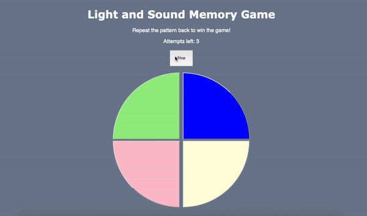

# Pre-work - *Memory Game*

**Memory Game** is a Light & Sound Memory game to apply for CodePath's SITE Program. 

Submitted by: Daniel Rodriguez

Time spent: 3 hours spent in total

Link to project: https://abyssinian-cat-crocodile.glitch.me/

## Required Functionality

The following **required** functionality is complete:

* [X] Game interface has a heading (h1 tag), a line of body text (p tag), and four buttons that match the demo app
* [X] "Start" button toggles between "Start" and "Stop" when clicked. 
* [X] Game buttons each light up and play a sound when clicked. 
* [X] Computer plays back sequence of clues including sound and visual cue for each button
* [X] Play progresses to the next turn (the user gets the next step in the pattern) after a correct guess. 
* [X] User wins the game after guessing a complete pattern
* [X] User loses the game after an incorrect guess

The following **optional** features are implemented:

* [X] Any HTML page elements (including game buttons) has been styled differently than in the tutorial
* [ ] Buttons use a pitch (frequency) other than the ones in the tutorial
* [ ] More than 4 functional game buttons
* [X] Playback speeds up on each turn
* [X] Computer picks a different pattern each time the game is played
* [X] Player only loses after 3 mistakes (instead of on the first mistake)
* [X] Game button appearance change goes beyond color (e.g. add an image)
* [ ] Game button sound is more complex than a single tone (e.g. an audio file, a chord, a sequence of multiple tones)
* [X] User has a limited amount of time to enter their guess on each turn

The following **additional** features are implemented:

- [ ] List anything else that you can get done to improve the app!

## GIF Walkthrough

Here's a walkthrough of implemented user stories:

## Reflection Questions
## 1. If you used any outside resources to help complete your submission (websites, books, people, etc) list them here. 
https://www.w3schools.com/js/js_timing.asp

## 2. What was a challenge you encountered in creating this submission (be specific)? How did you overcome it? (recommended 200 - 400 words)

One challenge I encountered was creating a timer for allowing the player an allotted time (10 seconds) to guess the pattern. 

In order to overcome this, I had to create a function called t which holds a setInterval() function that executes every seconds until it reaches 0 seconds. Within this setInterval function, the seconds variable decrements by 1 and a DOM innerHTML property is used to update the website/user of the decrementing timer. An if statement checks to see if the seconds have reached 0. Once it has, the clearInterval() function is used to stop the timer and the loseGame() function is executed to end the game.

But for function t() to even run, a setTimeout() function executes the t() function after the entire patterned is played.

## 3. What questions about web development do you have after completing your submission? (recommended 100 - 300 words) 

One question I have about web development after completing my submission is:
Would I have been able to make the buttons move around using Javascript? A feature like this would have increased the difficulty for the player.

## 4. If you had a few more hours to work on this project, what would you spend them doing (for example: refactoring certain functions, adding additional features, etc). Be specific. (recommended 100 - 300 words) 

As aforementioned in question 3, I would have spent time researching how I could make the buttons move around after each pattern is played. Also, I would have attempted to figure out how to make the buttons look more like the buttons on the actual 1978 Simon toy.

## License

    Copyright Daniel Rodriguez

    Licensed under the Apache License, Version 2.0 (the "License");
    you may not use this file except in compliance with the License.
    You may obtain a copy of the License at

        http://www.apache.org/licenses/LICENSE-2.0

    Unless required by applicable law or agreed to in writing, software
    distributed under the License is distributed on an "AS IS" BASIS,
    WITHOUT WARRANTIES OR CONDITIONS OF ANY KIND, either express or implied.
    See the License for the specific language governing permissions and
    limitations under the License.
